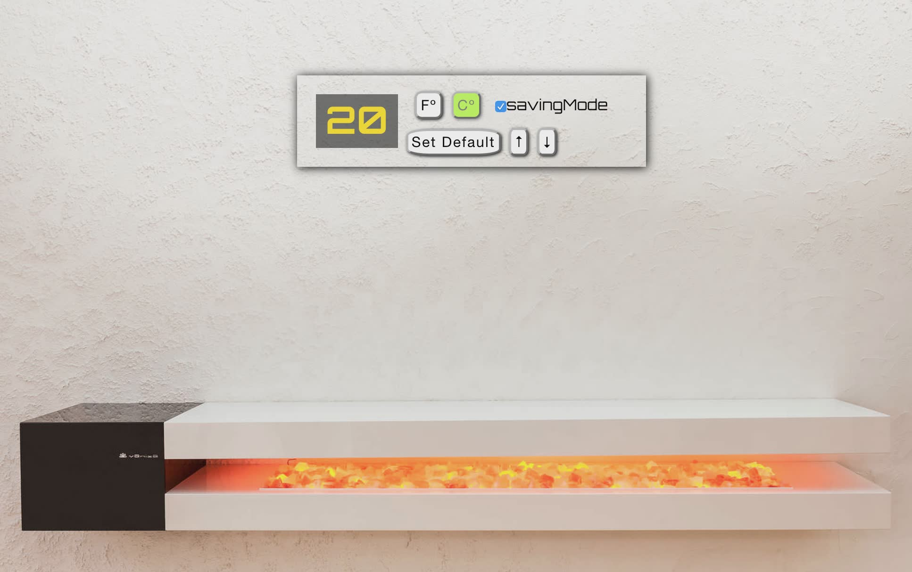

# Thermostat

This repo contains a thermostat written in javascript.

The functionality will be:

1. Thermostat starts at 20 degrees

2. You can increase the temp with the up button

3. You can decrease the temp with the down button

4. The minimum temperature is 10 degrees

5. If power saving mode is on, the maximum temperature is 25 degrees

6. If power saving mode is off, the maximum temperature is 32 degrees

7. Power saving mode is on by default

8. You can reset the temperature to 20 by hitting the reset button

9. You can see the temperature displayed in Celsius or Fahrenheit by pressing a button.

9. The thermostat should color the display based on energy usage - < 18 is green, < 25 is yellow, otherwise red

### Objectives

Testing javascript using Test Development Driven with different frameworks

===

### How to run the test

1. `clone https://github.com/byverdu/javascript-thermostat.git`

##### Mocha version

1. `cd javascript-thermostat/tested_with_mocha`
2. `npm install`
3. `mocha`

##### JS patterns version

1. `cd javascript-thermostat/testing_JS_patterns`
2. `npm install`
3. `mocha`

##### Jasmine version

1. `cd javascript-thermostat/tested_with_jasmine/jasmine/`
2.  open file SpecRunner.html in browser

### How to use it:

1. `clone https://github.com/byverdu/javascript-thermostat.git`
2. `cd javascript-thermostat/tested_with_jasmine` 
3. `bundle install`
4. `rackup`
5. Visit 127.0.0.1:9292

===

### The technologies used  

1. Mocha
1. Chai
1. Jasmine BDD
1. JQuery
1. Sinatra
1. HTML5 
1. CSS3

